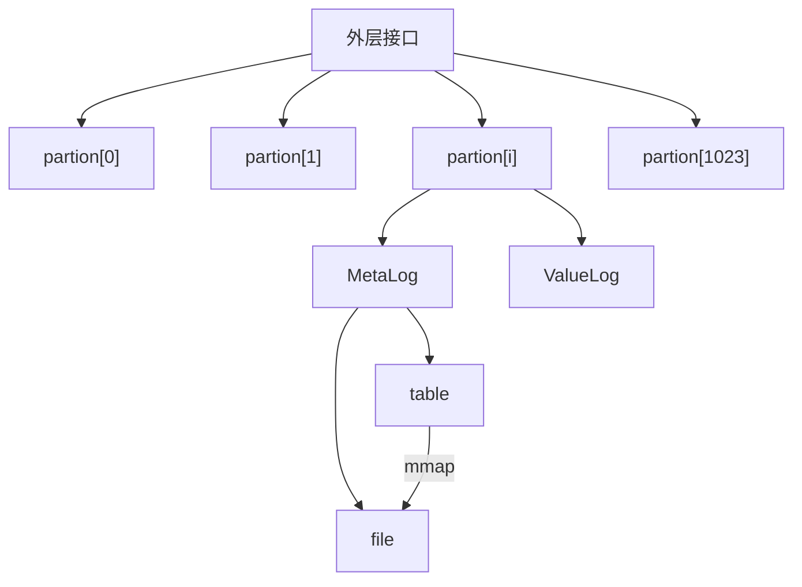
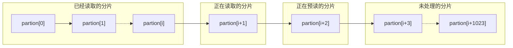
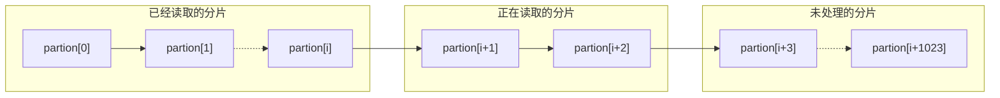

阿里数据库性能挑战大赛，最终排名32名
阿里数据库性能大赛总结
PolarDB作为软硬件结合的代表, 充分使用新硬件, 榨干硬件的红利来为用户获取极致的数据性能, 其中在PolarDB 的设计中, 我们使用 Optane SSD作为所有热数据的写入缓冲区, 通过kernel bypass的方式, 实现了极致的性能。所以本次比赛就以Optane SSD盘为背景，参赛者在其基础之上探索实现一种高效的kv存储引擎
本次比赛是我和章润学长使用C++共同完成的，[代码地址](https://github.com/xiaowangzhixiao/polardb)

<!-- more -->

# 1. 赛题规则

## 1.1. 赛题背景

PolarDB作为软硬件结合的代表, 充分使用新硬件, 榨干硬件的红利来为用户获取极致的数据性能, 其中在PolarDB 的设计中, 我们使用 Optane SSD作为所有热数据的写入缓冲区, 通过kernel bypass的方式, 实现了极致的性能。所以本次比赛就以Optane SSD盘为背景，参赛者在其基础之上探索实现一种高效的kv存储引擎

## 1.2. 初赛赛题描述

### 1.2.1. 题目内容

实现一个简化、高效的kv存储引擎，支持Write、Read接口

### 1.2.2. 语言限定

C++ & JAVA

**注：C++和JAVA一起排名**

### 1.2.3. 程序目标 

**C++:** 请仔细阅读engine/include/engine.h代码了解基类Engine定义，我们已为大家定义了比赛专用的子类EngineRace（在engine/engine_race目录下），参赛者通过编写代码，完善EngineRace来实现自己的kv存储引擎

**Java：**请仔细阅读engine/engine_java/src/main/java/com/alibabacloud/polar_race/engine/common/AbstractEngine.java了解基类AbstractEngine定义，我们已为大家定义了比赛专用的子类EngineRace（在engine/engine_java/src/main/java/com/alibabacloud/polar_race/engine/common/EngineRace.java文件中），参赛者通过编写代码，完善EngineRace来实现自己的kv存储引擎

**注：**

**1. 请完善我们已经定义好的子类EngineRace即可，不需要额外继承基类，否则评测程序可能会找不到实现代码**

### 1.2.4. 参赛方法说明
略
### 1.2.5. 测试环境

CPU：Intel(R) Xeon(R) CPU E5-2682 v4 @ 2.50GHz （64核）

磁盘：Intel Corporation Device 2701（345G、裸盘IOPS 580K、EXT4 IOPS 400K）

OS：Linux version 3.10.0-327.ali2010.alios7.x86_64

文件系统：EXT4

ulimit -a：

```
-t: cpu time (seconds)              unlimited
-f: file size (blocks)              unlimited
-d: data seg size (kbytes)          unlimited
-s: stack size (kbytes)             8192
-c: core file size (blocks)         0
-m: resident set size (kbytes)      unlimited
-u: processes                       948671
-n: file descriptors                655350
-l: locked-in-memory size (kbytes)  64
-v: address space (kbytes)          unlimited
-x: file locks                      unlimited
-i: pending signals                 948671
-q: bytes in POSIX msg queues       819200
-e: max nice                        0
-r: max rt priority                 0
-N 15:                              unlimited
```

JDK：

```
java version "1.8.0_152"
OpenJDK Runtime Environment (Alibaba 8.4.8) (build 1.8.0_152-b211)
OpenJDK 64-Bit Server VM (Alibaba 8.4.8) (build 25.152-b211, mixed mode)
```

Java JVM参数（已针对比赛场景进行了调优）:

```
-server
-Xms2560m 
-Xmx2560m 
-XX:MaxDirectMemorySize=256m 
-XX:NewRatio=1 
-XX:+UseConcMarkSweepGC 
-XX:+UseParNewGC 
-XX:-UseBiasedLocking 
```

### 1.2.6. 程序评测逻辑

评测程序分为2个阶段：

1. **Recover正确性评测**

   此阶段评测程序会并发写入特定数据（key 8B、value 4KB）同时进行任意次kill -9来模拟进程意外退出（参赛引擎需要保证进程意外退出时数据持久化不丢失），接着重新打开DB，调用Read接口来进行正确性校验

2. **性能评测**

   2.1 随机写入：64个线程并发随机写入，每个线程使用Write各写100万次随机数据（key 8B、value 4KB）

   2.2 随机读取：64个线程并发随机读取，每个线程各使用Read读取100万次随机数据

   2.3 顺序读取：64个线程并发顺序读取，每个线程使用Range全局**顺序**迭代DB数据2次

**注：**

**1. 共2个维度测试性能，每一个维度测试结束后会保留DB数据，关闭Engine实例，重启进程，清空PageCache，下一个维度开始后重新打开新的Engine实例**  

**2. 读取阶段会数据进行校验，没有通过的话则评测不通过**  

**3.参赛引擎只需保证进程意外退出时数据持久化不丢失即可，不要求保证在系统crash时的数据持久化不丢失**

**4. 整个评测会有时间限制（具体时限待公布），超时后评测结束且对应提交无结果**

### 1.2.7. 排名规则
略
### 1.2.8. 资源限制

内存占用不得超过：2G（C++), 3G(JAVA)
磁盘占用不得超过：320G
不使用压缩库
### 1.2.9. 作弊说明

1. 不得使用第三方kv引擎库（如RocksDB、LevelDB、LMDB等），在其之上封装接口用来参赛

2. 禁止使用tmpfs以及share memory等内存。包括但不限于： /dev/shm、/dev/pts、/sys /proc

3. 如果发现有作弊行为，包括但不限于：
    （1）通过hack评测程序，绕过了必须的评测逻辑
    （2）通过猜测数据格式进行针对性的压缩
    （3）窃取评测程序代码
     ... ...
    则成绩无效，且取消参赛资格。

## 1.3. 复赛赛题描述
 
复赛赛题及要求除如下增项外，其他同初赛一样：
 
### 1.3.1. 题目内容

在初赛题目基础上，还需要额外实现一个Range接口

### 1.3.2. 程序评测逻辑

评测程序分为2个阶段：

1. **Recover正确性评测**

此阶段评测程序会并发写入特定数据（key 8B、value 4KB）同时进行任意次kill -9来模拟进程意外退出（参赛引擎需要保证进程意外退出时数据持久化不丢失），接着重新打开DB，调用Read、Range接口来进行正确性校验

2. **性能评测**

2.1 随机写入：64个线程并发随机写入，每个线程使用Write各写100万次随机数据（key 8B、value 4KB）

2.2 随机读取：64个线程并发随机读取，每个线程各使用Read读取100万次随机数据

2.3 顺序读取：64个线程并发顺序读取，每个线程各使用Range**有序（增序）**遍历全量数据**2**次

**注：顺序读取阶段除了对迭代出来每条的kv校验是否匹配外，还会额外校验是否严格递增，如不通过则终止，评测失败**

# 2. 赛题分析与架构设计
## 2.1. KV数据库整体框架
### 2.1.1. 数据规模分析
本赛题要实现一个key-value的数据库，key长度为8Byte，value大小固定为4KB，测评过程中，有64个线程，每个线程分别写100万次数据，则value的每个4KB大小的数据总共要占250G，必然要放在磁盘中，内存中放key和value的索引。value的索引可以用value的逻辑位置表示，则可以使用32位整数表示。基本索引结构如下：
```cpp
struct Location {
    uint64_t key;
    uint32_t addr;
};
```
由于内存对齐，单个结构体会占用16B，假设不考虑顺序、数据结构，只存放索引，占用977M，gcc编译器下可以使用__attribute__((packed))取消内存对齐，则每个结构体占用12B，整体占用732M，可以完全放到内存中。
### 2.1.2. 意外退出分析
第一阶段的测评程序中，要求在程序意外退出时，能保证已存储的数据不丢失，那么意味着不仅value要按顺序落盘，key和value逻辑地址组成的索引也需要写到硬盘中，等到程序恢复时重新读取索引值，在内存中重建索引。
### 2.1.3. 并发问题分析
64个线程并发写数据，最直接的想法是每个线程一个分片，这样可以达到最大并发，线程之间没有互斥关系。但是考虑到一个问题，在复赛阶段要做顺序读取数据，如果各个分片之间没有顺序，会导致在复赛阶段很难实现顺序读取的要求，而且测评程序写入的数据基本是大小均匀分布的，则考虑将分片设为按照大小分片，即取uint64表示的key高位分片，将分片设为有序。
### 2.1.4. 整体框架设计
根据上述的分析，整个的架构设置为1024个分片，每个分片中有两个模块，分别称为索引日志模块MetaLog和ValueLog模块，ValueLog中管理value的文件写入和读取，MetaLog中管理Location的记录和管理，MetaLog中有两部分，一是索引在内存中的一个数据结构，称为table，为读接口提供高效的查询和更新，二是MetaLog文件，实时记录索引，为防止程序意外退出。


## 2.2. 细节技术问题
### 2.2.1. 数据转换
程序输入的key是字符串的形式，由于长度不变，可以使用uint64表示，我使用了union转换了数据：
```cpp
union Str2Uint {
    char data[8];
    uint64_t key;
};

uint64_t chang2Uint(const PolarString &key) {
    union Str2Uint data;
    size_t size = key.size();
    // 可以使用memcpy
    for (size_t i = 0; i < 8; ++i) {
        if (i < size) {
            data.data[i] = key[i];
        } else {
            data.data[i] = 0;
        }
    }
    return data.key;
}
```
注意，linux系统下数据是小端存储，要使用key进行比较时，需要使用函数bswap_64转换一下，或者在复制时手动将顺序反过来。

### 2.2.2. MetaLog
* MetaLog中内存部分的table使用的数据结构和算法在比赛过程中经过了几次的变化，这个在之后有详细的介绍；
* MetaLog写文件的部分，由于Meta数据每次是16B写入的，文件IO大块数据写入速度较快，则创建文件是使用fallocate预分配大小，并配置为mmap，使用原子变量offset维护偏移量，不使用锁机制，没有锁的开销，充分使用pagecache，加快写入速度。读取时使用direct io或mmap均可，具体使用哪种技术随着table的数据结构在变化。

### 2.2.3. ValueLog
* ValueLog文件读写同样使用原子变量offset维护文件的偏移量，使用pwrite和pread解决多线程问题读取文件时的并发问题；
* 写入文件阶段利用系统的pagecache聚合，自己指定策略使用fsync刷盘；
* 顺序读取时，分片value读文件使用direct io，跳过用户态和pagecache的复制，直接将数据从磁盘读出，由于最后阶段一直在优化其他部分，读阶段value没有使用direct io，现在想想，尝试一下可能成绩会更好。

## 2.3. 全序遍历结构设计
* 整个数据使用高位分片，测评程序要求64个线程全序遍历，那么最好是将64个线程齐头并进，所有线程可以共享同一个分片的value数据。
* 根据比赛要求的内存，可以将2-3个分片中的value数据全部读取到内存中，形成了一个滑动窗口的模型，启动一个预读线程，监控当前正在读的分片64个线程读取情况，当64个线程全部读完当前分片i，预读分片就释放分片i的value数据空间，并读取i+2的数据，当然，这个在一开始时要提前读取两个分片，而且要等待所有线程都到达之后再开始读取，否则会有不同步的情况。
* 这个模型下并没有强行限制64个线程的齐头并进，完全是由预读线程控制的，换句话说，当遍历速度很快时，齐头并进的效果是由读取速度决定的，当预读线程读取完当前分片，遍历的线程才能开始遍历，当遍历速度较慢或参差不齐时，则64个线程的遍历位置会分布在已经读完成的2个线程里，整体速度取决于最慢的线程，因为只有第i个分片被所有线程读完时，才能进入i+2的预读。





## 2.4. kv数据库流程说明
### 2.4.1. 写入流程
1. 转换key并获取分片index；
2. 将value写入ValueLog，获取逻辑地址；
3. key与逻辑地址组合为Location，放入MetaLog中，因为写数据和读数据是分开的，所以比赛最终选择了不维护动态索引，在写阶段只使用mmap顺序写入MetaLog文件。

### 2.4.2. 读取流程
1. 转换key并获取分片index；
2. 若是第一次读取该分片，则先将MetaLog文件用mmap映射到内存，使用归并排序，同时重复数据取逻辑地址较大的；
3. 二分查找取到Location；
4. 从ValueLog文件中读取value。

### 2.4.3. 恢复流程
开64个线程分别负责16个分片中MetaLog数据的归并排序

### 2.4.4. 全序遍历流程
1. 第一个线程到来开启预读线程，先读取两个分片的value数据到内存，使用原子变量控制等待所有线程到齐；
2. 所有线程到齐后，开始顺序遍历分片中的数据，当分片未载入内存时等待；
3. 预读线程隔一小段时间检测第i个分片是否被64个线程读完，读完就释放第i个分片中value的空间，并加载i+2的value数据，i++。

# 3. 比赛过程及技术与框架的变更
## 3.1. 初赛：skiplist动态索引
在初赛一开始，为了维护动态索引，我学习并实现了skiplist这个数据结构，并且使用__sync_bool_compare_and_swap这样的原子操作保证插入操作的原子性，但是由于其所占空间太大，需要的多余指针较多，内存总是会超出界限。

## 3.2. 初赛：hashtable动态索引
将skiplist换为了hashtable，hash函数是取key的中间几位，这样整个哈希表基本是有序的，为了有序，处理冲突是使用链表的方式，有序插入，这样在查找和遍历方面也能达到很好的平衡，当然这也只是在比赛的环境下，key的分布基本均匀的情况下，在实际生产环境中肯定是不能使用这种hash函数的。这种结构大幅减少了指针所占空间，也没有爆内存，但是由于疏忽，在写value时没做到原子性，初赛一直没有通过，然后就直接改为了静态索引，在写入时没有维护索引，在读取时归并排序整理MetaLog，二分查找。

## 3.3. 复赛：direct io读取value
复赛完成了滑动窗口的机制后，整体速度并不快，成绩只是在620s，读取整个分片是正常使用pread，然后学习了使用direct io，在顺序读取时，读取整个分片的value数据使用了direct io，使用之后成绩大幅提升，到达了460s。

## 3.4. 复赛：预读线程改为单线程
之后对预读线程进行了改进，之前预读线程是64个遍历线程检查条件达到后就启动一个预读线程，为了减小线程开销，就在顺序读取一开始创建了一个预读线程，由一个线程管理数据的释放和预读，这个优化程度并不大，成绩有所抖动，最好一次到达了448s。
# 4. 不足与改进
## 4.1. 写入value
写入value是使用系统的pagecache进行聚合，然后调用fsync刷盘的，其实可以自己用小文件做数据聚合，然后使用direct io落盘，这样落盘过程控制程度大大加强，效果可能会更好。
## 4.2. 读取value
1. 读取value可以使用direct io进行尝试一下，不过不使用direct io，系统会做一定的预读，这两个的性能对于此次比赛的测评程序谁更好也不好说，最好的方式是将系统预读关闭，自己使用direct io，并加入预读机制，这样参数可以调到最佳；
2. 读取value时可以交个几个线程去负责，这样可以降低64个线程io的竞争。效果可能会更好。

## 4.3. 通用化
抛开这个比赛，整个系统要到达实用的地步，必然要维护动态索引的，关于一开始尝试的skiplist还可以进一步研究一下。
